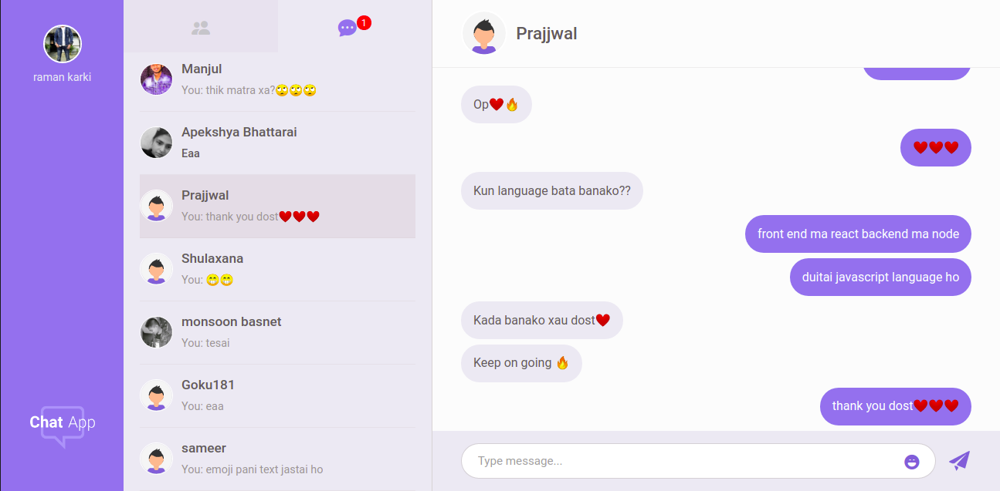
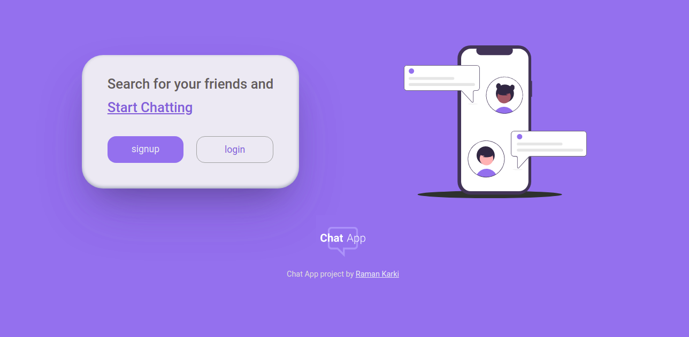

<!-- intro -->
<h1>Chat App</h1>
<p>It is a normal chatting web app like any other app. Fully responsive, mobile first aproach. Build with MERN stack. Hosted with <a href="https://www.netlify.com/" target="_blank">Netlify</a>. </p>

<br>

<!-- badges -->
<div align="center">
  
  
</div>

<br>

<!-- screen shot -->
<div align="center">
  
</div>

<br>

<h2>Get started</h2>
<p>You can see this project live <a href="https://raman-chatapp.netlify.app/#/" target="_blank"> here.</a></p>

<br>

## Build with

These were the main technologies used in this project.

- [Mongodb](https://www.mongodb.com/) - Nosql document based database
- [ExpressJS](https://expressjs.com/) - NodeJS framework for web and mobile applications
- [React](https://reactjs.org/) - JavaScript library for building user interfaces
- [Redux](https://redux.js.org/) - A Predictable State Container for JS Apps
- [NodeJS](https://nodejs.org/en/) - JavaScript runtime engine built on Chrome's V8 JavaScript engine a that runs javascript outside the web browser

<br>

some other technologies are,

- [Sass](https://sass-lang.com/) - Preprocessor scripting language for CSS
- [react-bootstrap](https://react-bootstrap.github.io/) - The most popular front-end framework for UI components
- [Bootstrap](https://getbootstrap.com/) - The most popular front-end framework
- [Pusher](https://pusher.com/) - Powering realtime experiences for mobile and web
- [JWT](https://jwt.io/) - JSON Web Tokens are an open, industry standard RFC 7519 method for representing claims securely between two parties
- [Mongoose](https://mongoosejs.com/) - Mongoose provides a straight-forward, schema-based solution to model your application data
- [Multer](https://www.npmjs.com/package/multer) - Package for handeling files from form data
- [Pug](https://pugjs.org/api/getting-started.html) - Template generator for server side rendering.

<br>

<h2>Local setup</h2>
<p>Client and server has separate repository and therefore two server will be running at the same time at different root level directory. So, keep them separately.</p>
<div>
  
</div>

<br>

<h3>Prerequisites</h3>

<p>Install <a href="https://nodejs.org/en/" target="_blank">node</a>, npm and <a href="https://git-scm.com/downloads" target="_blank">git</a> .</p>

<br>

<h2>Server setup</h2>

```
git clone https://github.com/ramankarki/chat-app-api.git

cd chat-app-api

npm install nodemon -g

npm install
```

<br>

Create a config.env file in root and add some env variables.

```
NODE_ENV=development
DB_STRING=your mongodb database string

// I have used sendgrid to send emails,
// create a sendgrid account and after your setup is done add your credentials here

SENDGRID_USERNAME=your sendgrid username
SENDGRID_PW=your sendgrid password
EMAIL_FROM=email from which you are sending mails.

JWT_SECRET=any random string you want (preferred min 32 strings)
JWT_EXPIRES_IN=expiry date for your jwt tokens
JWT_COOKIE_EXPIRES_IN=expiry date for your cookies

// I have used pusher to make this app real time
// create a pusher account and after your setup is done add your credentials here

PUSHER_APP_ID=your pusher app id
PUSHER_KEY=your pusher app key
PUSHER_SECRET_KEY=your pusher secret key
PUSHER_CLUSTER=your pusher app cluster
```

<br>

Now you are done and can start your development server

```
npm run dev
```

<br>

<h2>Client setup</h2>

```

git clone https://github.com/ramankarki/chat-app-client.git

cd chat-app-client

npm install
```

<br>

Create a .env file in root and add an env variable, since I have used sass.

```
SASS_PATH=node_modules:src/*
```

<br>

Create a config folder inside /src folder and create dev.js file inside config folder to add some secret keys.

```
module.exports = {
  PUSHER_KEY: "YOUR PUSHER KEY FOR CLIENT SIDE",
  PUSHER_CLUSTER: "YOUR PUSHER CLUTER",
};
```

<br>

Now you are done for client side as well and can start your react development server

```
npm run dev
```

<br>

<h3>Now it should open homepage of this chat app on your default browser</h3>

<div align="center">
  
</div>
